<!-- BANNER - terminal profile.sh --live -->
<picture>
  <source media="(prefers-color-scheme: dark)"  srcset="assets/banner-dark.v9.svg">
  <source media="(prefers-color-scheme: light)" srcset="assets/banner-light.v9.svg">
  
</picture>

 

<!-- NAME / TAGLINE - animated typing -->

 

&nbsp;&nbsp;
&nbsp;&nbsp;

 

---

## This is me :)

Hi, I'm **Kavi**, an DSA enthusiast, problem solver and software developer from India 🇮🇳.
I like turning ideas into real products — from full-stack applications to software projects and problem-solving.

- 🧠 Practicing **DSA and problem-solving** with Java
- 💻 Building software with **Python, JavaScript/TypeScript, React and Node.js**
- ☕ Using **Java primarily for DSA and competitive/problem-solving practice**
- 🚀 Learning by building, shipping and iterating
- 🛠️ Interested in **DSA × software × problem-solving**
- 🌱 Learning by building, shipping and iterating

 

## my perfect stack

---

## signals

<table>
<tr>
<td width="50%" align="center">

<picture>
  <source media="(prefers-color-scheme: dark)" srcset="assets/radar-dark.svg">
  <source media="(prefers-color-scheme: light)" srcset="assets/radar-light.svg">
  
</picture>

</td>
<td width="50%" align="center">

<picture>
  <source media="(prefers-color-scheme: dark)" srcset="assets/radar-ai-dark.svg">
  <source media="(prefers-color-scheme: light)" srcset="assets/radar-ai-light.svg">
  
</picture>

</td>
</tr>
</table>

---

## Numbers matter? ohhh yes.

<picture>
  <source media="(prefers-color-scheme: dark)" srcset="assets/card-stats-dark.svg">
  <source media="(prefers-color-scheme: light)" srcset="assets/card-stats-light.svg">
  
</picture>

 

---

## what I'm building

| AI | Full Stack | Automation |
|:---:|:---:|:---:|
| Intelligent applications | Production web apps | Business workflows |
| Agents & AI tooling | React / Node / Firebase | APIs & integrations |

---

` Build • Ship • Automate `

